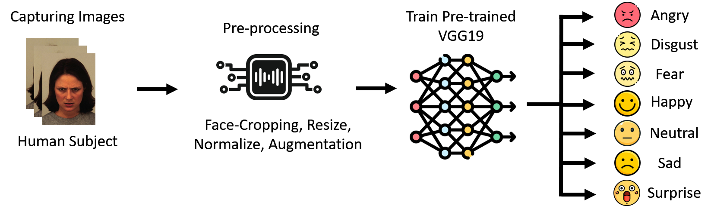

A course project on Facial Emotion Recognition using OpenCV and Transfer Learning, where we used the JAFFE, CK+, KDEF and FER-2013 datasets and cropped face from image samples, resized them to match network's input layer, and augmented them with random rotations and translations. Then we fed them to the pre-trained VGG19 neural network for emotion predictions from captured facial images. 

